<p align="center">
  
</p>

<p align="center">
  
</p>

<p align="center">
  <a href="https://www.linkedin.com/">
    
  </a>
  <a href="mailto:seu-email@email.com">
    
  </a>
  <a href="https://www.instagram.com/">
    
  </a>
</p>

<p align="center">
  
  
</p>

---

## `> whoami`

Sou estudante de **Desenvolvimento de Sistemas** e desenvolvedor em formação, com foco em desenvolvimento de aplicações web, APIs, bancos de dados e soluções orientadas a dados.

Tenho experiência prática construindo aplicações completas utilizando **React, JavaScript, TypeScript, Node.js, Python, FastAPI e PostgreSQL**, além de explorar áreas relacionadas a **Ciência de Dados e Inteligência Artificial**.

Gosto de transformar problemas reais em aplicações funcionais, buscando sempre melhorar arquitetura, organização de código, experiência do usuário e qualidade do projeto.

```js
const dev = {
  nome: "Guilherme Zamboni Menegacio",
  cargo: "Desenvolvedor Full Stack",
  formacao: "Ciência de Dados e IA - SENAI",

  tecnologias: [
    "JavaScript",
    "Python",
    "React",
    "Node.js",
    "FastAPI",
    "PostgreSQL",
    "MongoDB"
  ],

  interesses: [
    "Desenvolvimento Web",
    "Backend",
    "Ciência de Dados",
    "Inteligência Artificial"
  ],

  status: () => "Provavelmente codando..."
};
```

---

## `> stack`

### Languages

<p>
  
  
  
  
  
</p>

### Frontend

<p>
  
  
</p>

### Backend

<p>
  
  
  
</p>

### Databases

<p>
  
  
</p>

### Tools

<p>
  
  
  
  
</p>

---

## `> projects`

| Project                         | Description                                                                                                                                     | Stack                                       |
| :------------------------------ | :---------------------------------------------------------------------------------------------------------------------------------------------- | :------------------------------------------ |
| **Sistema de Gestão de Vendas** | Sistema completo para gerenciamento de clientes, vendas e operações comerciais, desenvolvido com arquitetura separada entre frontend e backend. | `React` `TypeScript` `FastAPI` `PostgreSQL` |
| **QuimioAnalytics**             | Solução voltada à análise e visualização de dados, desenvolvida como projeto da KiraSapiens TechSolutions.                                      | `Python` `Data Science` `Analytics`         |
| **Panteão Pizzaria**            | E-commerce de pizzas com sistema de personalização de produtos, carrinho e cálculo de pedidos.                                                  | `React` `JavaScript` `CSS`                  |
| **Placar de Dardos Casual**     | Aplicação web mobile-first para partidas de dardos com modos 301 e 501.                                                                         | `React` `JavaScript` `CSS`                  |

Mais projetos estão disponíveis na minha aba de repositórios.

---

## `> stats`

<!--
  Os cards abaixo são gerados automaticamente pelo GitHub Actions
  e armazenados diretamente neste repositório.
-->

<p align="center">
  
  
</p>

<p align="center">
  <picture>
    <source
      media="(prefers-color-scheme: dark)"
      srcset="https://raw.githubusercontent.com/GuiZamb32/GuiZamb32/output/github-contribution-grid-snake-dark.svg"
    />
    <source
      media="(prefers-color-scheme: light)"
      srcset="https://raw.githubusercontent.com/GuiZamb32/GuiZamb32/output/github-contribution-grid-snake.svg"
    />
    
  </picture>
</p>

---

## `> currently`

```text
Building       → Full Stack applications
Backend        → FastAPI / Node.js
Frontend       → React / TypeScript
Database       → PostgreSQL / MongoDB
Exploring      → Data Science & AI
Improving      → Software Architecture
```

---

## `> contact`

<p align="center">
  <a href="https://github.com/GuiZamb32">
    
  </a>
  <a href="https://www.linkedin.com/">
    
  </a>
</p>

<p align="center">
  <sub>Building. Learning. Improving.</sub>
</p>
