<p align="center">
  
</p>

<p align="center">
  
</p>

<p align="center">
  <a href="https://www.linkedin.com/in/guilherme-zamboni-000624301/">
    
  </a>

  <a href="mailto:guilhermezamboni867@gmail.com">
    
  </a>

  <a href="https://www.instagram.com/guilherme_zamboni_32/">
    
  </a>
</p>

<br>

---

## Sobre

Sou **Guilherme Zamboni Menegacio**, desenvolvedor Full Stack e estudante de **Ciência de Dados e Inteligência Artificial**.

Tenho interesse em construir aplicações completas, desde a interface e experiência do usuário até APIs, bancos de dados e processamento de informações.

Atualmente, meu foco está na evolução das minhas habilidades em **desenvolvimento web, backend, bancos de dados, análise de dados e inteligência artificial**.

* **Formação:** Bacharelando em Ciência de Dados e IA — SENAI
* **Área principal:** Desenvolvimento Full Stack
* **Estudando:** Python, FastAPI, React, TypeScript, análise de dados e IA
* **Interesses:** Tecnologia, História, Biologia, música, academia e vôlei
* **Objetivo:** Unir desenvolvimento de software, dados e inteligência artificial para criar soluções úteis e escaláveis

<br>

---

## Perfil

```js
const dev = {
  nome: "Guilherme Zamboni Menegacio",
  cargo: "Desenvolvedor Full Stack",
  formacao: "Ciência de Dados e IA - SENAI",

  tecnologias: [
    "JavaScript",
    "Python",
    "React",
    "Node.js",
    "FastAPI",
    "PostgreSQL",
    "MongoDB"
  ],

  interesses: [
    "Desenvolvimento Web",
    "Backend",
    "Ciência de Dados",
    "Inteligência Artificial"
  ],

  hobbies: [
    "Código",
    "Academia",
    "Música",
    "Vôlei"
  ],

  status: () => "Provavelmente codando..."
};
```

<br>

---

## Toolbox Tecnológico

### Desenvolvimento

<p align="left">
  
  
  
  
  
  
</p>

### Bancos de Dados

<p align="left">
  
  
</p>

### Ferramentas

<p align="left">
  
  
  
  
  
  
</p>

---

## Projetos em Destaque

### Sistema de Gestão de Vendas

Sistema Full Stack desenvolvido para gerenciamento de clientes e processos relacionados à gestão de vendas.

**Tecnologias:**

`React` `TypeScript` `Python` `FastAPI` `PostgreSQL` `SQLAlchemy`

---

### QuimioAnalytics

Projeto voltado para análise e visualização de dados, desenvolvido como uma solução dentro do portfólio da **KiraSapiens TechSolutions**.

**Tecnologias:**

`React` `JavaScript` `Data Analysis` `Data Visualization`

---


## Estatísticas do GitHub

<p align="center">
  <picture>
    <source
      media="(prefers-color-scheme: dark)"
      srcset="./profile/stats-dark.svg"
    />
    <source
      media="(prefers-color-scheme: light)"
      srcset="./profile/stats-light.svg"
    />
    
  </picture>

  <picture>
    <source
      media="(prefers-color-scheme: dark)"
      srcset="./profile/top-langs-dark.svg"
    />
    <source
      media="(prefers-color-scheme: light)"
      srcset="./profile/top-langs-light.svg"
    />
    
  </picture>
</p>

<br>

### Atividade

<p align="center">
  <picture>
    <source
      media="(prefers-color-scheme: dark)"
      srcset="./profile/activity-dark.svg"
    />
    <source
      media="(prefers-color-scheme: light)"
      srcset="./profile/activity-light.svg"
    />
    
  </picture>
</p>

---

## Contribuições

<p align="center">
  <picture>
    <source
      media="(prefers-color-scheme: dark)"
      srcset="https://raw.githubusercontent.com/GuiZamb32/GuiZamb32/output/github-contribution-grid-snake-dark.svg"
    />
    <source
      media="(prefers-color-scheme: light)"
      srcset="https://raw.githubusercontent.com/GuiZamb32/GuiZamb32/output/github-contribution-grid-snake.svg"
    />
    
  </picture>
</p>

---

## Contato

<p align="center">
  <a href="https://www.linkedin.com/in/guilherme-zamboni-000624301/">
    
  </a>

  <a href="mailto:guilhermezamboni867@gmail.com">
    
  </a>

  <a href="https://github.com/GuiZamb32">
    
  </a>
</p>

<br>

<p align="center">
  
</p>


</p>
